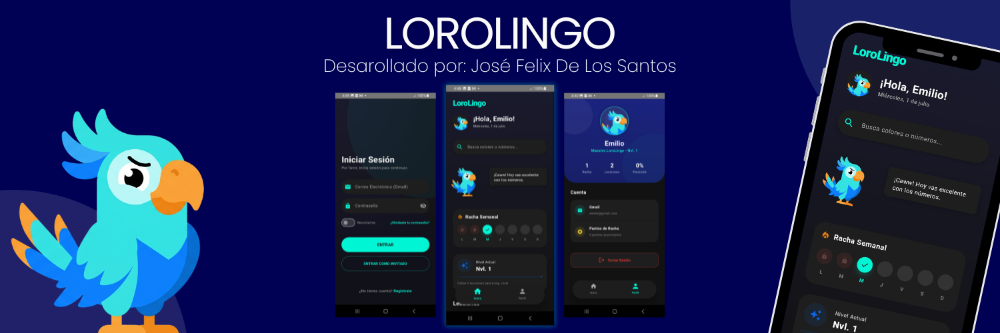

# LoroLingo

## Academic Information

**Course:** Mobile Device Programming  
**Professor:** Emilio Peña  
**University:** Universidad Católica del Cibao (UCATECI)  
**Student:** José Félix DLS  
**Student ID:** 2024-1135  

## Project Objective

The objective of this project is to develop an interactive educational mobile application that facilitates learning basic English vocabulary while applying the concepts learned in the Mobile Device Programming course. The application serves as a practical and engaging platform that allows users to explore and learn colors and numbers in English through a modern interface.

## Description

LoroLingo is an educational mobile application developed in Android Studio that provides an intuitive and visual way to learn fundamental English concepts. Designed with a clean, dark-mode optimized interface and a custom mascot named Loro, the application features interactive modules that help users learn colors and numbers in English.

The latest major update introduces robust account management with strict security validations, a premium UI/UX overhaul featuring fluid animations, and improved under-the-hood stability. It includes an interactive quiz system, instant answer validation, an animated Daily Tip section, and a personalized results screen where Loro reacts according to the user's performance, creating a highly engaging and motivating learning experience.

## Included Modules

1. Colors in English
2. Numbers in English (1 to 100)
3. Interactive Quiz Module
4. Secure Authentication & Account Management
5. User Profile & Performance Results Screen
6. Animated Daily Tip Section

## Features

1. **Modern Brand Identity & Premium UI:** Two-tone branding (White and Cyan), a consistent 28.dp corner radius for all popups, elegant typography, and a polished dark theme.
2. **Fluid Navigation:** Implementation of seamless Slide & Fade transitions between screens (Login, Register, Home) for a highly dynamic user experience.
3. **Robust Security & Form Validation:** Strict rules for email domains and special characters, featuring real-time color feedback (Cyan to Green/Red) and a fortified registration button that only activates when 100% of the fields are correct.
4. **Account Recovery:** Professional "Forgot your password?" system that validates user emails and securely displays the recovered key in a highlighted card.
5. **Dynamic Avatars & Guest Mode:** Visual distinction between active users (full color) and guest accounts (grayscale). Error messages and guest restrictions now use Premium floating Snackbars that display above the navigation bar.
6. **Interactive Mascot (Loro):** Motivational bubble messages and personalized reactions based on user quiz performance.
7. **Educational Quizzes & Feedback:** 30 randomized questions (colors and numbers) with instant green/red highlighting, corrections, and an automatic grading system.
8. **Animated Content:** A "Daily Tip" system that smoothly rotates educational tips every 10 seconds.
9. **Enhanced Stability & Performance:** Resolved critical compilation issues (EvalIssueException) related to KSP and Room via optimized `gradle.properties`, ensuring flawless build execution.

## Technologies Used

1. Kotlin
2. Jetpack Compose
3. Android Studio
4. Room Database

## Project Status

Completed academic project developed for educational purposes. Continually updated with advanced UI/UX designs, robust security validations, fluid animations, and interactive learning features to maximize user engagement and showcase high-level mobile development skills.
